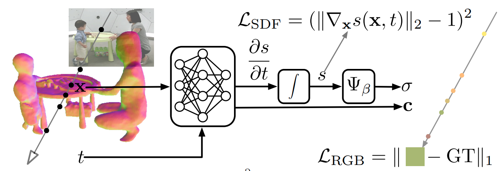

## Neural SDF Flow for 3D Reconstruction of Dynamic Scenes


This is the code for the paper

Wei Mao, Richard Hartley, Mathieu Salzmann, Miaomiao Liu. 
[_Neural SDF Flow for 3D Reconstruction of Dynamic Scenes_](https://github.com/wei-mao-2019/SDFFlow). In ICLR 24.

[[paper](https://github.com/wei-mao-2019/SDFFlow)] [[talk](https://github.com/wei-mao-2019/SDFFlow)]

### Dependencies
* Python >= 3.8
* Open3D >= 0.15.0
* [PyTorch](https://pytorch.org) >= 2.0
* Tensorboard

### Datasets
#### CMU Panoptic dataset
For the original dataset please visit their website [http://domedb.perception.cs.cmu.edu/](http://domedb.perception.cs.cmu.edu/).

Here we provide processed clips from five videos from the dataset: band1, cell1, hanggling_b2, ian3 and pizza1.

### Training and Evaluation
* The training and evaluation script is included in ``./code/run.sh`` file.

### Citing

If you find our code usefull, please also consider to cite our work

```
@inproceedings{mao2024neural,
  title={Neural SDF Flow for 3D Reconstruction of Dynamic Scenes},
  author={Mao, Wei and Liu, Miaomiao and Hartley, Richard and Salzmann, Mathieu},
  journal={ICLR},
  year={2024}
}

```

### Acknowledgments

The overall code framework (dataloading, training, testing etc.) is adapted from [VolSDF](https://github.com/lioryariv/volsdf). 

The auto computation of gradient in forward call is adapted from [DNS](https://github.com/za-cheng/DNS/blob/main/Model.py)

### Licence
MIT
